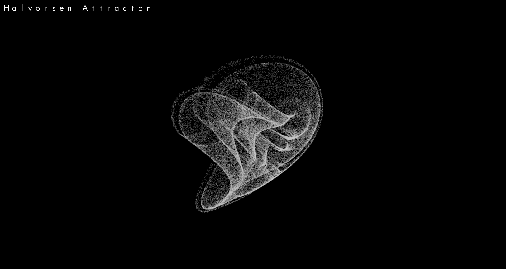

# AttractorVisuialisation
A visualisation of mathematical attractors using C++ &amp; SFML 

## Dependecies
- SFML: Instructions on how to install SFML can be found <a src="https://www.sfml-dev.org/tutorials/2.5/start-vc.php">here</a>
- MinGW (Windows)

## Example Video
<a src="https://www.youtube.com/watch?v=TB8PrRNOKAM">https://www.youtube.com/watch?v=TB8PrRNOKAM</a>

## Controls 
- WASD: Move the attractor up, left, down, right 
- Up-Down arrows: Rotate the attractor on its X-axis
- Left-Right arrows: Rotate the attractor on its Z-axis
- Z: zoom in
- X: zoom out
- LShift: speed up
- LControl: speed down
- R: Increase red colour
- G: Increase green colour
- B: increase blue colour
- Backspace: reset colour

